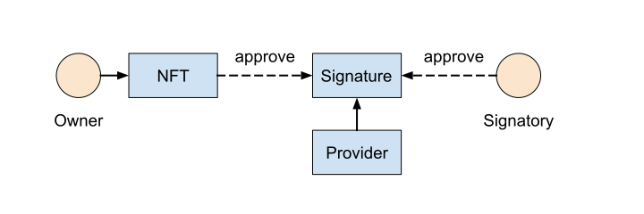

- **TEP**: [90](https://github.com/ton-blockchain/TEPs/pull/90)
- **title**: Token Signature Contract
- **status**: DRAFT
- **type**: Contract Interface
- **authors**: [Serge Polyanskikh](https://github.com/sergey-msu), ...
- **created**: 10.29.2022
- **replaces**: -
- **replaced by**: -

# Summary

Token Signature Contract (TSC) - is a special type of contract which acts as an agreement between the owner and the signatory. Leaving a signature on an object serves as a validation by the third party. The signature belongs to its specific NFT object and cannot be forwarded to anyone, as it is being a special type of SBT ([TEP 89](https://github.com/ton-blockchain/TEPs/blob/master/text/0085-sbt-standard.md)).

# Motivation

The concept of signing NFT objects is a demanded and natural tool, which has lots of potential applications. For example, an electronic document in the blockchain, that must be signed by interested parties, can act as an NFT object. In this case, the following concept of signing the document is a fundamental base of electronic document management on the TON blockchain. Another entertaining application has to do with looking at a signature as an autograph. In case a celebrity signs an NFT object, its collectible value will instantly increase, and will also serve as an additional anti-scam verification.

# Guide

<p align="center">
 
    <br>
    <em>Fig. 1: General scheme of signing NFT objects.</em>
</p>

TSC is an agreement between an NFT object owner and a signatory. The TSC must be released by Signature Provider - an official signature authority that can be trusted by both the owner & the signatory. 

The general scheme of the solution is shown in Fig. 1. Provider here is a kind of authority contract that can have a basic NFT collection interface. It is responsible for issuing (mint) Signature contracts at the request of either the NFT owner (Owner) or a third party (Signatory). The Signature contract is another NFT item that belongs to the originally signed object without the right to transfer. Thus, the Signature contract issued by the Provider is essentially a special kind of SBT token.

Approval of the signature by the signer can be carried out by a transaction to the signing contract with a special op code. This ensures that the signer's approved signature cannot be compromised by a phishing attack or otherwise.
Approval of the signature from the NFT owner side is more complicated. A transaction on the part of both the owner of the NFT and the NFT itself cannot serve as a confirmation of the signature, since before it is completed, the object can be transferred to another owner, which can create an unpleasant side effect. The solution may be to vote the NFT object, which is, to transfer it to the object of the signature and immediately return it to the previous owner.

The described architecture for the implementation of NFT signing does not require an extension of the existing NFT [standard](https://github.com/ton-blockchain/TEPs/blob/master/text/0062-nft-standard.md) and can be implemented using already existing mechanics defined by the standard. Thus, once it is implemented, the signing scheme can be used for all previously issued NFTs whose contracts are compatible with the existing [standard](https://github.com/ton-blockchain/TEPs/blob/master/text/0062-nft-standard.md).

# Specification

The presence of Signature Provider authority in the general scheme is optional, and the details of its implementation may depend on specific business goals. Thus, it does not need a unique specification.

In its nature TSC is SBT, a standard NFT token which cannot be transferred to another NFT object. It also has to contain all the necessary information about the object itself, the signatory and the details of the signature (for example, the signatory's text message).

TSC storage TL-B schema:

```
storage#_ index:uint64 
provider_address:MsgAddressInt owner_address:MsgAddressInt 
object_address:MsgAddressInt signatory_address:MsgAddressInt 
is_approved_by_owner:Bool is_approved_by_signatory:Bool 
signature_payload:(Maybe ^Cell) = Storage;
```

`provider_address` -  address of the signature provider authority.

`owner_address` -  address of the NFT owner at the moment of TSC instance creation.

`object_address` -  address of the NFT object.

`signatory_address` -  signatory address.

`is_approved_by_owner` - if true, TSC is approved by NFT owner.

`is_approved_by_signatory` - if true, TSC is approved by signatory.

`signature_payload` - arbitrary signature content (e.g. text message).

#### 1. `transfer`

NFT transfer operation with standard operation code 0x5fcc3d14 should always be rejected.

#### 2. `approve_by_signatory`

TL-B schema of inbound message:
```
approve_by_signatory#3eecd61c query_id:uint64 
signature_payload:(Maybe ^Cell) response_destination:MsgAddress 
response_amount:(VarUInteger 16) response_payload:(Either Cell ^Cell) = InternalMsgBody;
```
`query_id` -  arbitrary request number.

`signature_payload` -  arbitrary content to store in the Signature contract (e.g. text message).

`response_destination` - address where to send a response with confirmation of a successful signature approve by the signatory.

`response_amount` - amount of coins to be sent to the response address.

`response_payload` - optional custom data that should be sent to the response address.

**Should be rejected if:**

1. Message is not from `signatory_address` address.
2. There are not enough coins to process operation and send message to `response_destination` address.
3. The field `is_approved_by_signatory` is already set to True.

**Otherwise should do:**

1. Set `is_approved_by_signatory` field to True.
2. Set `signature_payload` field to incoming signature_payload cell.
3. If there is nonempty `response_destination` and nonzero `response_amount`, send `response_amount` of nanotons along with the `forward_payload` to this address with the following TL-B scheme:
```
notify_approve#a2761bc0 query_id:uint64 signatory_address:MsgAddress 
response_payload:(Either Cell ^Cell) = InternalMsgBody;
```
Here `query_id` should be equal with request's `query_id`. `response_payload` should be equal with request's `forward_payload`. `signatory_address` is address of the signatory. If `response_amount` is equal to zero, notification message should not be sent.

#### 3. `approve_by_owner`

TL-B schema of inbound message is exactly the same as in the [standard](https://github.com/ton-blockchain/TEPs/blob/master/text/0062-nft-standard.md) in the section describes sending message to new NFT owner address (Signature contract in this case) after transferring it:
```
ownership_assigned#05138d91 query_id:uint64 prev_owner:MsgAddress
forward_payload:(Either Cell ^Cell) = InternalMsgBody;
```
`query_id` -  arbitrary request number.

`forward_payload` - ignored by Signature contract.

`prev_owner` - ignored by Signature contract.

**Should be rejected if:**

1. Message is not from `object_address` address.
2. There are not enough coins to process operation and send transfer ownership message to `object_address` address.
3. The field `is_approved_by_owner` is already set to True.

**Otherwise should do:**

1. Set `is_approved_by_owner` field to True.
2. Set `owner_address` to addr_none.
3. Return the NFT object to its owner by the standard transfer ownership operation described [here](https://github.com/ton-blockchain/TEPs/blob/master/text/0062-nft-standard.md). The TL-B scheme of outbound message should also coincide with the one from the standard:
```
transfer#5fcc3d14 query_id:uint64 new_owner:MsgAddress
response_destination:MsgAddress custom_payload:(Maybe ^Cell) 
forward_amount:(VarUInteger 16) forward_payload:(Either Cell ^Cell) = InternalMsgBody;
```
Here `query_id` is arbitrary request number. `new_owner` must be equal to `owner_address`. The rest parameters may depend on the specific business problem being solved.

#### 4. `return_object`

This operation is designed to eliminate the risk of losing the NFT by the owner during the signing process and freezing it on the signature contract without the possibility of a return.

TL-B schema of inbound message:
```
return_object#33d73e72 query_id:uint64 = InternalMsgBody;
```
`query_id` -  arbitrary request number.

**Should be rejected if:**

1. Message is not from `object_address` address.
2. There are not enough coins to process operation and send transfer ownership message to `object_address` address.
3. The field `is_approved_by_owner` is already set to True.

**Otherwise should do:**

1. Set `is_approved_by_owner` field to True.
2. Set `owner_address` to addr_none.
3. Return the NFT object to its owner by the standard transfer ownership operation described here. The TL-B scheme of outbound message should also coincide with the one from the standard:
```
transfer#5fcc3d14 query_id:uint64 new_owner:MsgAddress
response_destination:MsgAddress custom_payload:(Maybe ^Cell) 
forward_amount:(VarUInteger 16) forward_payload:(Either Cell ^Cell) = InternalMsgBody;
```
Here `query_id` is arbitrary request number. `new_owner` must be equal to owner_address. The rest parameters may depend on the specific business problem being solved.

# Get-methods

1. `get_nft_data()` - same as in NFT standard with some specificity added. The method returns `(int init?, int index, slice collection_address, slice owner_address, cell individual_content)`. Here `init?` - if not zero, then this TSC is fully initialized and ready for interaction. `index` - numerical index of this TSC in the collection. For provider-less TSC - arbitrary but constant value. `collection_address` - (MsgAddress) address of the smart contract of the collection to which this TSC belongs - equals the Provider address. For provider-less NFT this parameter should be addr_none; `owner_address` - (MsgAddress) must be equal to the NFT object address which TSC belongs to. `individual_content` - must be equal to the signature_payload field of TSC.
2. `get_signature_data()` - returns signature-specific information: `(slice provider_address, slice object_address, slice signatory_address, int is_approved_by_owner, int is_approved_by_signatory, cell signature_payload)`. Here provider_address is signature provider address, `object_address` is the address of the NFT object, `signatory_address` is the signatory address, `is_approved_by_owner` - if true, TSC is approved by NFT owner, `is_approved_by_signatory` - if true, TSC is approved by signatory, `signature_payload` is the arbitrary signature content (e.g. text message).
